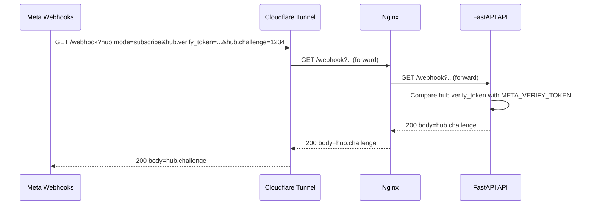
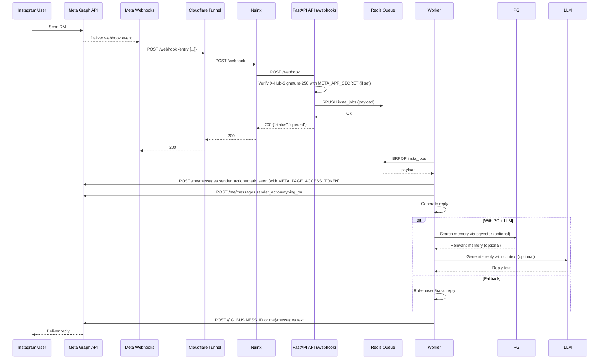
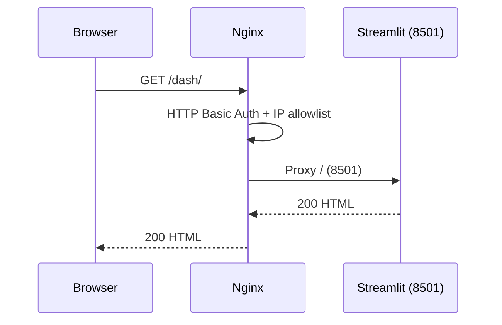
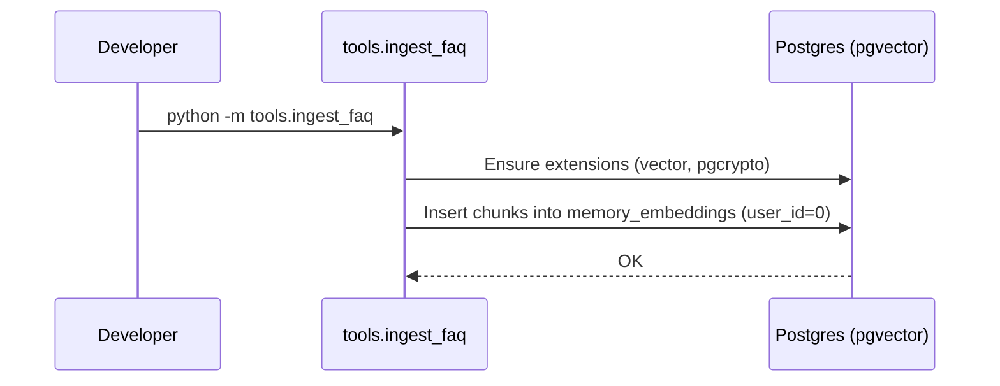

# Architecture & Sequence Diagrams

This document outlines the key components of Insta Agent and the end‑to‑end request flows using sequence diagrams.

## Components
- Nginx reverse proxy (rate limiting, optional basic auth for dashboard)
- API (FastAPI): `/webhook`, `/health`, privacy/data-deletion pages
- Redis: queue for webhook events
- Worker: consumes queue, generates replies, calls Meta Graph API
- Meta Graph API: receives outgoing messages and actions
- Cloudflare Tunnel (dev): exposes local Nginx/API over HTTPS
- Optional: Postgres (pgvector) for memory/RAG, LLM provider (Groq/Ollama)

## Webhook Verification (GET)

Notes
- Verify token: `META_VERIFY_TOKEN`
- Endpoint: `GET /webhook` returns the raw `hub.challenge` when valid.

## Incoming DM Processing (POST)

Notes
- Outbound endpoint: `/{META_IG_BUSINESS_ID}/messages` if `META_IG_BUSINESS_ID` is set, else `/me/messages`.
- Tokens: `META_PAGE_ACCESS_TOKEN` (+ `appsecret_proof` if `META_APP_SECRET` provided).
- Rate limiting: Nginx `limit_req` on `/webhook`.

## Dashboard Proxy (optional)

Notes
- Basic auth: `nginx/.htpasswd` (replace defaults before prod).
- IP allowlist: `nginx/allow_dash.conf`.

## FAQ Ingestion (RAG)

## Key Environment Variables
- `META_VERIFY_TOKEN` (webhook verification)
- `META_APP_SECRET` (signature/appsecret_proof)
- `META_PAGE_ACCESS_TOKEN` (required for sending messages)
- `META_IG_BUSINESS_ID` (optional; selects IG Business endpoint)
- `REDIS_URL`, `POSTGRES_URL` (optional for RAG), `LLM_PROVIDER` + provider keys

## Health & Ops
- API health: `GET /health` (proxied at `/health` via Nginx)
- Logs: `docker compose logs -f api worker`
- Tunnel (dev): Cloudflare quick tunnel exposes Nginx/API for Meta webhooks

